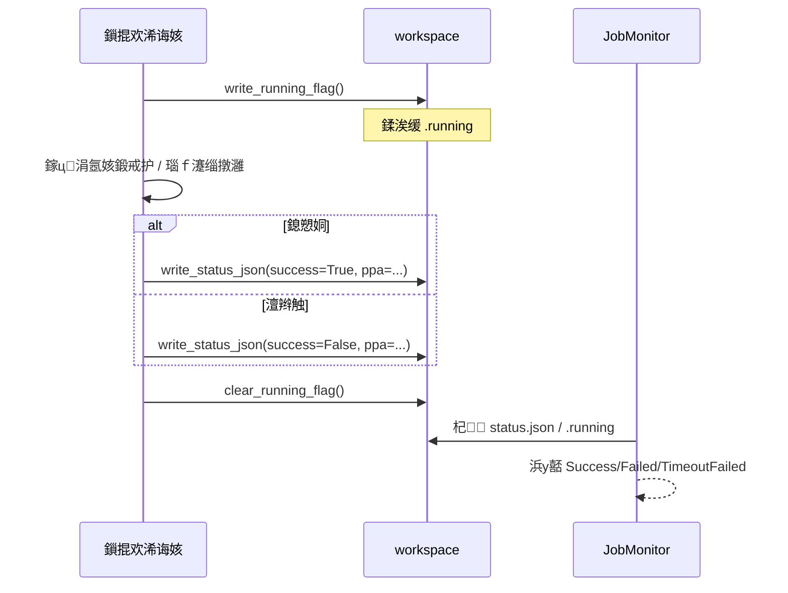

# 璐＄尞鎸囧崡锛欵DA 浠诲姟鎻掍欢寮€鍙戯紙SOP锛?
鏈枃闈㈠悜闇€瑕佸湪浠撳簱鍐?*鏂板 EDA 宸ュ叿瀵规帴鎴栧瓙浠诲姟**鐨?IC / 宸ュ叿閾惧伐绋嬪笀銆傜洰鏍囨槸鍦?*涓嶆敼鍔ㄨ皟搴﹀唴鏍?*鐨勫墠鎻愪笅锛屼互鎻掍欢鏂瑰紡鎵╁睍鑳藉姏銆?
---

## 1. 寮€鍙戝師鍒?
| 瑙勫垯 | 璇存槑 |
|------|------|
| **瑙勮寖鏂囦欢** | 鑻ヤ粨搴撴牴鐩綍瀛樺湪 **`.cursorrules`**锛屽紑鍙戜笌鎻愪氦鍓嶉』瀹屾暣闃呰骞堕伒瀹堛€?|
| **绂佹闅忔剰淇敼绯荤粺浠ｇ爜** | **`src/eda_tasks/`**锛堟彃浠跺熀搴с€乣BaseEDAJob` 濂戠害锛変笌 **`src/flow_controller/runtime/`**锛堢洃鎺с€佽皟搴﹀惊鐜級瑙嗕负**绯荤粺浠ｇ爜**銆傜己闄蜂慨澶嶆垨閫氱敤鑳藉姏澧炲己椤婚€氳繃璇勫锛?*涓氬姟涓撶敤宸ュ叿閫昏緫涓嶅緱鍐欏叆涓婅堪鐩綍**銆?|
| **鎵╁睍浣嶇疆** | 鎵€鏈夋柊澧炲伐鍏枫€佹祦绋嬪簭銆佸巶鍟嗛€傞厤**浠呭厑璁?*鍦?**`src/eda_tasks/plugins/`** 涓嬩互 **Python 鍖?妯″潡**褰㈠紡鏂板锛屽苟閫氳繃 **`BaseEDAJob` + `JobRegistry`** 娉ㄥ唽銆?|
| **娴嬭瘯** | 蹇呴』鍦?**`tests/test_jobs/`** 涓嬩负鏂板鎻掍欢缂栧啓 pytest锛?*绂佹**鍦?CI/鏈湴鍗曟祴涓湡瀹炶皟鐢?EDA 鍙墽琛屾枃浠舵垨璁稿彲璇佹湇鍔°€?|

---

## 2. 瀹炴垬姝ラ锛圫tep-by-Step锛?
### Step 1锛氱户鎵垮熀绫诲苟娉ㄥ唽

鍦?**`src/eda_tasks/plugins/`** 涓嬫柊澧炴ā鍧楋紙渚嬪 `src/eda_tasks/plugins/my_tool/my_job.py`锛夛紝缁ф壙锛?
```text
from eda_tasks.base_job import BaseEDAJob
```

涓虹被璁剧疆**鍏ㄥ眬鍞竴**鐨?`job_type`锛堝缓璁?`鍩?宸ュ叿.鍚嶇О` 椋庢牸锛屽 `eda.drc.calibre_dummy`锛夈€傚瓙绫诲畾涔夎鍔犺浇鏃讹紝浼氶€氳繃 `__init_subclass__` 鑷姩娉ㄥ唽鍒?`JobRegistry`锛堟棤闇€鏀逛腑澶垪琛級銆?
**鍏ュ彛鍙戠幇**锛氬簲鐢ㄥ惎鍔ㄦ椂璋冪敤涓€娆?`eda_tasks.plugins.registry.discover_jobs()`锛屼互鎵弿 `src/eda_tasks/plugins` 鍖呭唴妯″潡锛堜笌鐜版湁 `tests/test_jobs/test_job_registry.py` 琛屼负涓€鑷达級銆?
---

### Step 2锛氬疄鐜扮敓鍛藉懆鏈熸柟娉?
褰撳墠 **`src/eda_tasks/base/base_job.BaseEDAJob`** 瑕佹眰瀛愮被**蹇呴』瀹炵幇**浠ヤ笅涓変釜鎶借薄鏂规硶锛堜笌甯﹀畬鏁村瓙杩涚▼娴佹按绾跨殑 `eda_tasks.pipeline.BaseEDAJob` 涓嶅悓锛岃鍕挎贩娣嗭級锛?
| 鏂规硶 | 鑱岃矗 |
|------|------|
| **`pre_check()`** | 鏍￠獙杈撳叆鏂囦欢銆佽鍒欑墝銆丩icense 鐜鍙橀噺銆佸彲鎵ц璺緞绛夛紱涓嶆弧瓒虫椂搴旀姏寮傚父鎴栬褰曞悗涓锛岄伩鍏嶇敓鎴愭棤鏁堣剼鏈€?|
| **`generate_scripts()`** | 鐢熸垚 EDA 鎵€闇€鑴氭湰锛堝 `.tcl`銆乣.sp`銆乣.sh`锛夛紝杩斿洖**涓昏剼鏈矾寰?* `Path`銆?|
| **`post_check()`** | 鍦ㄥ伐鍏锋墽琛岀粨鏉熷悗瑙ｆ瀽鏃ュ織/鎶ュ憡锛屽垽鏂繚瑙勬暟銆佹敹鏁涙€х瓑锛涘彲涓?`pre_check` 瀵瑰簲锛屽舰鎴愰棴鐜€?|

**鍏充簬銆屾墽琛?/ run銆?*锛?
- **鏍稿績鎻掍欢濂戠害**涓?*娌℃湁**鍚嶄负 `run` 鐨勬娊璞℃柟娉曪紱鑻ヤ綘闇€瑕佸湪鏈彃浠跺唴**鐩存帴璋冪敤 `subprocess`** 鎷夎捣 EDA 鍛戒护琛岋紝寤鸿锛?  - 灏嗗叿浣撴墽琛屽皝瑁呭湪**绉佹湁鏂规硶**锛堝 `_run_eda()`锛変腑锛屽苟鍦ㄥ悎閫傜殑鐢熷懡鍛ㄦ湡闃舵璋冪敤锛涙垨
  - 鍙傝€?**`src/eda_tasks/pipeline/base_job.py`** 涓殑 **`build_command()`銆乣execute_pipeline()`** 绛夋ā鏉挎柟娉曪紙璇ヨ矾寰勫睘浜?*鍙傝€冨疄鐜?*锛屾柊鎻掍欢浠嶅簲鏀惧湪 `src/eda_tasks/plugins/`锛屼笖涓嶈涓洪€傞厤瀹冭€屼慨鏀?`eda_tasks` 鎴?`flow_controller/runtime`锛夈€?- 鏃犺閲囩敤浣曠鎵ц鏂瑰紡锛?*浠诲姟宸ヤ綔鐩綍**鍐呴渶婊¤冻涓嬫枃鐨?**`status.json` 绾﹀畾**锛屼互渚?`JobMonitor` 涓?DAG 鐘舵€佷竴鑷淬€?
---

### Step 3锛氱姸鎬佹眹鎶ョ害瀹氾紙鏍稿績锛?
璋冨害渚х殑 **`JobMonitor`**锛坄src/flow_controller/runtime/orchestrator/monitor.py`锛夋牴鎹换鍔¤妭鐐逛笂鐨?**`workspace_path`** 杞锛?
| 鏂囦欢 | 浣滅敤 |
|------|------|
| **`.running`** | 杩愯涓爣蹇楋紱瀛樺湪鏃堕棿瓒呰繃闃堝€间笖浠嶆棤鍚堟硶 `status.json` 鏃讹紝鍙垽涓鸿秴鏃剁被鐘舵€併€?|
| **`status.json`** | 浠诲姟**缁撴潫**鏃跺啓鍏ョ殑**缁堟€?*鎽樿锛涜В鏋愭垚鍔熷垯寰楀埌 `Success` / `Failed` 鍙婃寚鏍囥€?|

**`status.json` 鎺ㄨ崘瀛楁**锛堜笌 `JobMonitor` 鐨?`StatusJsonPayload` 涓€鑷达級锛?
| 瀛楁 | 绫诲瀷 | 璇存槑 |
|------|------|------|
| **`status`** | 瀛楃涓?| **`Success`** 鎴?**`Failed`**锛堝ぇ灏忓啓涓嶆晱鎰燂紝瑙ｆ瀽鍚庝細瑙勮寖鍖栵級銆?|
| **`ppa`** | 瀵硅薄 | 閿负瀛楃涓层€佸€间负**娴偣鏁?*鐨勬寚鏍囧瓧鍏革紙濡傚姛鑰椼€佹椂搴忋€丏RC 鏁伴噺绛夛級锛涙棤鍒欏彲涓?`{}`銆?|

**绀轰緥锛氬湪浠诲姟宸ヤ綔鐩綍鍐欏叆 `status.json`**

```python
import json
from pathlib import Path

def write_status_json(workspace: Path, success: bool, metrics: dict) -> None:
    """浠诲姟缁撴潫鏃惰皟鐢紱metrics 鐨?value 椤诲彲杞负 float锛堜笌鐩戞帶鍣?Pydantic 妯″瀷涓€鑷达級銆?""
    payload = {
        "status": "Success" if success else "Failed",
        "ppa": {k: float(v) for k, v in metrics.items()},
    }
    path = workspace / "status.json"
    path.write_text(json.dumps(payload, indent=2), encoding="utf-8")
```

鑻ヤ綘甯屾湜澶嶇敤缁熶竴宸ュ叿鍑芥暟锛屽彲鐩存帴浣跨敤锛歚flow_controller.runtime.status_reporting.write_running_flag()` / `write_status_json()` / `clear_running_flag()`銆?
**鎺ㄨ崘鏃跺簭锛堝浘鏂囷級**锛?


**娉ㄦ剰**锛氫笟鍔′笂甯歌鐨勩€宮etrics銆嶅湪鏈粨搴撶洃鎺фā鍨嬩腑钀藉湪 **`ppa`** 瀛楁鍚嶄箣涓嬶紱鑻?JSON 缂哄瓧娈垫垨绫诲瀷涓嶇锛岀洃鎺у櫒浼氬洖閫€鍒板熀浜?`.running` 鐨勬帹鏂€昏緫锛屽彲鑳藉鑷寸姸鎬佷笉濡傞鏈熴€?
---

### Step 4锛歍DD 涓庢祴璇曠害鏉?
| 瑕佹眰 | 璇存槑 |
|------|------|
| **浣嶇疆** | 鏂板娴嬭瘯鏂囦欢鏀惧湪 **`tests/test_jobs/`**锛屽懡鍚嶅缓璁?`test_<鎻掍欢鍚?.py`銆?|
| **绂佹** | **绂佹**鍦ㄥ崟鍏冩祴璇曚腑鐪熷疄鎵ц Calibre銆乂irtuoso銆丠Spice 绛夊晢涓?閲嶅瀷 EDA 杞欢銆?|
| **鎺ㄨ崘** | 浣跨敤 **`unittest.mock.patch`**锛堟垨 `pytest-mock`锛夋ā鎷?**`subprocess.run` / `subprocess.Popen`**銆佹枃浠剁郴缁熸晱鎰熸搷浣滐紝浠呮柇瑷€浣犳柟鎻掍欢鐨?*鍛戒护琛屾嫾瑁呫€佹棩蹇楄В鏋愩€乻tatus.json 鍐呭**銆?|
| **鍙傝€?* | 鐜版湁 `tests/test_eda_jobs.py`銆乣tests/test_job_registry.py` 涓殑 mock 鍐欐硶銆?|

**鏈€灏忕ず渚嬶細妯℃嫙瀛愯繘绋?*

```python
from unittest.mock import patch, MagicMock

@patch("subprocess.run")
def test_my_job_builds_command(mock_run: MagicMock) -> None:
    mock_run.return_value = MagicMock(returncode=0, stdout="", stderr="")
    # 瀹炰緥鍖栦綘鐨勬彃浠讹紝璋冪敤浼氳Е鍙?subprocess 鐨勮矾寰勶紝鐒跺悗锛?    mock_run.assert_called_once()
    # 瀵?argv銆乧wd 绛夊仛鏂█
```

---

## 3. 鏋佺畝鎻掍欢妯℃澘锛圖ummyJob锛?
浠ヤ笅楠ㄦ灦鍙洿鎺ュ鍒跺埌 `src/eda_tasks/plugins/<鍖呭悕>/<妯″潡>.py` 骞舵寜宸ュ叿鏀瑰啓銆?*涓嶈**鎶婅鏂囦欢鎻愪氦涓哄悓鍚嶇敓浜фā鍧楁椂蹇樿鏀?`job_type` 涓庣被鍚嶃€?
```python
"""绀轰緥锛氭渶灏?BaseEDAJob 鎻掍欢锛堟棤鐪熷疄 EDA 璋冪敤锛夈€?""

from __future__ import annotations

from pathlib import Path

from eda_tasks.base_job import BaseEDAJob


class DummyJob(BaseEDAJob):
    """鍗犱綅鎻掍欢锛氭紨绀烘敞鍐屼笌涓夐樁娈电敓鍛藉懆鏈熴€?""

    job_type = "eda.example.dummy"

    def pre_check(self) -> None:
        """妫€鏌ヨ緭鍏ャ€丩icense銆佺幆澧冨彉閲忕瓑銆?""
        return None

    def generate_scripts(self) -> Path:
        """鐢熸垚涓昏剼鏈苟杩斿洖璺緞銆?""
        out = Path("dummy_run.tcl")
        out.write_text("# dummy\n", encoding="utf-8")
        return out.resolve()

    def post_check(self) -> None:
        """瑙ｆ瀽鏃ュ織/鎶ュ憡锛屽垽鎴愬姛鎴栬繚瑙勩€?""
        return None
```

### 鍙鍒垛€滃浘鏂囬棴鐜€濇ā鏉匡紙鎺ㄨ崘锛?
```python
from pathlib import Path
from typing import Dict

from eda_tasks.base_job import BaseEDAJob
from flow_controller.runtime.status_reporting import (
    clear_running_flag,
    write_running_flag,
    write_status_json,
)


class DummyWithStatusJob(BaseEDAJob):
    job_type = "eda.example.dummy_with_status"

    def __init__(self, workspace: Path) -> None:
        self.workspace = workspace

    def pre_check(self) -> None:
        return None

    def generate_scripts(self) -> Path:
        script = self.workspace / "run.sh"
        script.parent.mkdir(parents=True, exist_ok=True)
        script.write_text("#!/usr/bin/env bash\necho ok\n", encoding="utf-8")
        return script

    def post_check(self) -> None:
        return None

    def execute(self) -> Dict[str, float]:
        write_running_flag(self.workspace)
        try:
            # TODO: 璋冪敤 subprocess/宸ュ叿鎵ц
            ppa = {"drc_violations": 0.0}
            write_status_json(self.workspace, success=True, ppa=ppa)
            return ppa
        except Exception:
            write_status_json(self.workspace, success=False, ppa={})
            raise
        finally:
            clear_running_flag(self.workspace)
```

鎺ュ叆鐪熷疄娴佹按绾挎椂锛岃鍦?*浠诲姟宸ヤ綔鐩綍**涓簬閫傚綋鏃舵満鍐欏叆 **`.running`**锛堝紑濮嬶級涓?**`status.json`**锛堢粨鏉燂級锛屽苟涓庝换鍔℃祦缁勪欢涓嬪彂鐨?`workspace_path` 瀵归綈銆?
---

## 4. 鎻愪氦鍓嶈嚜妫€

- [ ] 鏈慨鏀?`src/eda_tasks/`銆乣src/flow_controller/runtime/` 涓笌鏈渶姹傛棤鍏崇殑鏂囦欢銆?- [ ] 鏂颁唬鐮佷粎浣嶄簬 `src/eda_tasks/plugins/`锛堝強瀵瑰簲娴嬭瘯 `tests/test_jobs/`锛夈€?- [ ] `python -m pytest tests` 閫氳繃锛屼笖鏃犱笉蹇呰鐨勫閮?EDA 渚濊禆銆?- [ ] 鏃ュ織浣跨敤 `logging`锛岀敓浜ц矾寰勯伩鍏?`print()`锛堜笌椤圭洰瑙勮寖涓€鑷达級銆?
