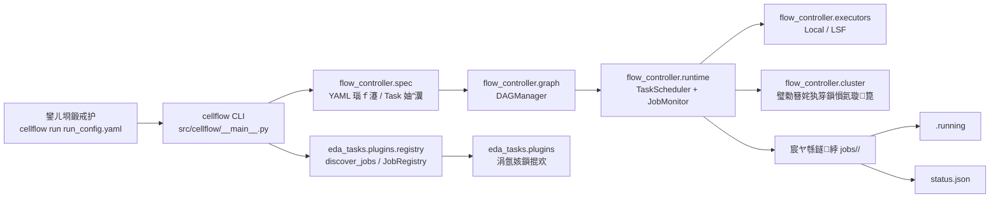

# EDA Scheduler

闈㈠悜 **EDA锛堢數瀛愯璁¤嚜鍔ㄥ寲锛?* 鍦烘櫙鐨?**鍒嗗竷寮忎换鍔¤皟搴︿笌鑷姩鍖栫紪鎺?* 妗嗘灦锛氬湪闅旂鐨勬墽琛岀幆澧冧腑缁勭粐宸ュ叿閾撅紝鏀寔 DAG 渚濊禆銆佹湰鍦颁笌闆嗙兢鍙岃建鎵ц锛屽苟閫氳繃宸ヤ綔鍖哄唴鐨勬爣蹇楁枃浠朵笌 `status.json` 瀹炵幇鏃犵姸鎬併€佸彲鎭㈠鐨勪换鍔＄洃鎺с€?

---

## Architecture Doc

- Full scheduler layered flow and runtime call chain: `docs/ARCHITECTURE.md`

---

## 鏍稿績鐗规€?

| 鑳藉姏 | 璇存槑 |
|------|------|
| **杞‖鐜闅旂** | 閫氳繃 `FLOW_ROOT`銆乣PYTHONPATH` 涓?`bin/env.sh` 鍖哄垎銆屽彧璇昏蒋浠舵爲銆嶄笌鐢ㄦ埛宸ョ▼鐩綍锛涘伐浣滃尯璺緞鏍￠獙閬垮厤灏嗕骇鐗╁啓鍏ュ畨瑁呭尯銆?|
| **DAG 浠诲姟缂栨帓** | 鍩轰簬 YAML 鐨?`FlowConfig` 涓?`TaskConfig`锛岀敱 `DAGManager` 缁存姢渚濊禆涓庡氨缁叧绯伙紝鏀寔鐜娴嬨€?|
| **鏈湴 / 闆嗙兢鍙岃建** | `sys_config` 涓殑鎵ц妯″紡鍙垏鎹㈡湰鍦版墽琛屽櫒锛堝 `LocalExecutor`锛変笌闆嗙兢鎻愪氦锛堝 LSF 閫傞厤锛夛紝涓婂眰璋冨害閫昏緫涓庢墽琛屽悗绔В鑰︺€?|
| **鏃犵姸鎬佺洃鎺?* | `JobMonitor` 杞浠诲姟 `workspace_path` 涓嬬殑 **`.running`** 涓?**`status.json`**锛氫笉渚濊禆闀胯繛鎺ワ紝閫傚悎 EDA 闀夸綔涓氫笌鏂偣缁窇鍦烘櫙銆?|
| **鎻掍欢鍖?EDA 浣滀笟** | `src/eda_tasks/plugins/` 涓嬬殑鎻掍欢缁ф壙 `eda_tasks.base_job.BaseEDAJob`锛岀粡 `eda_tasks.plugins.registry.JobRegistry` 鑷敞鍐岋紝渚夸簬鎸夊伐鍏锋墿灞曡€屾棤闇€鏀硅皟搴﹀唴鏍搞€?|

---

## 鏋舵瀯鍥撅紙鍥炬枃锛?



**鏂囧瓧瑙ｈ**锛?
- **flow_controller** 璐熻矗鈥滀换鍔℃祦鈥濓細鏋勫缓銆佽皟搴︺€佺洃鎺с€佹墽琛屽悗绔€?
- **eda_tasks** 璐熻矗鈥淓DA浠诲姟鈥濓細鍩虹被濂戠害銆佹彃浠舵敞鍐屻€佹彃浠跺疄鐜颁笌 `TaskTemplate`銆?
- **sys_config** 璐熻矗杩愯閰嶇疆妯″瀷锛屼笉缁戝畾涓氬姟瀹炵幇缁嗚妭銆?

---

## 鐩綍缁撴瀯

```text
<浠撳簱鏍?/
鈹溾攢鈹€ bin/                    # 鐜鍏ュ彛锛歅ATH / PYTHONPATH / FLOW_ROOT
鈹溾攢鈹€ src/
鈹?  鈹溾攢鈹€ flow_controller/    # 宸ヤ綔娴佺鐞嗗櫒锛欴AG/YAML/璋冨害/鐩戞帶/鎵ц鍚庣
鈹?  鈹溾攢鈹€ eda_tasks/          # EDA 浠诲姟锛歍askTemplate銆佸熀绫?娉ㄥ唽/鎻掍欢/鍙鐢ㄥ簱
鈹?  鈹斺攢鈹€ sys_config/         # 绯荤粺閰嶇疆锛氭墽琛屼笌杩愯鏃堕厤缃ā鍨?
鈹溾攢鈹€ tests/                  # pytest锛涗复鏃朵笌浜х墿榛樿鍦?test_work/锛堣 pytest.ini锛?
鈹溾攢鈹€ share/                  # 鐢ㄦ埛鍙绀轰緥涓?Demo
鈹?  鈹溾攢鈹€ README_USER.md
鈹?  鈹斺攢鈹€ demos/              # 绀轰緥 run_config.yaml銆乺un_demo.sh
鈹溾攢鈹€ scripts/                # 寮€鍙戠敤婕旂ず鑴氭湰锛堝鏈湴骞惰 demo锛?
鈹溾攢鈹€ pyproject.toml
鈹斺攢鈹€ requirements.txt
```

| 璺緞 | 鑱岃矗 |
|------|------|
| **`bin/`** | 鎻愪緵 `env.sh`锛氬鍑?`FLOW_ROOT`锛堜粨搴撴牴锛夈€佸皢 `bin` 涓?`src` 鍔犲叆 `PATH` / `PYTHONPATH`锛屽疄鐜颁笌鍏蜂綋宸ョ▼鐩綍鐨勯殧绂汇€?|
| **`src/flow_controller/`** | **宸ヤ綔娴佺鐞嗗櫒**锛氬伐浣滄祦鏋勫缓锛圖AG/YAML锛夈€佽皟搴︽帹杩涗笌鐩戞帶銆佹墽琛屽悗绔笌闆嗙兢璧勬簮鎻愪氦銆?|
| **`src/eda_tasks/`** | **EDA 浠诲姟缁勪欢**锛歚TaskTemplate`銆佺粺涓€ `BaseEDAJob` 鐦﹀绾︿笌鎻掍欢娉ㄥ唽锛坄eda_tasks.plugins.registry`锛夛紝鎻掍欢瀹炵幇浣嶄簬 `eda_tasks/plugins/`銆?|
| **`share/demos/`** | **鐢ㄦ埛浣跨敤鍖?*锛氭斁绀轰緥杈撳叆銆乣run_config.yaml` 涓?`run_demo.sh`锛屼究浜庡鍒跺埌鑷繁鐨勫伐绋嬪悗鏀硅矾寰勪笌浠诲姟鍙傛暟銆?|

---

## 蹇€熶笂鎵?

**鍓嶇疆**锛歎nix 椋庢牸 shell锛圠inux / macOS / **Git Bash** / WSL锛夈€備粨搴撴牴鐩綍涓嬪凡鎻愪緵 `bin/env.sh`銆?

```bash
# 1. 杩涘叆浠撳簱鏍癸紙璇峰皢璺緞鎹负浣犵殑鍏嬮殕璺緞锛?
cd /path/to/scheduler

# 2. 鍔犺浇鐜锛團LOW_ROOT 鎸囧悜浠撳簱鏍癸紝Python 鍙?import src 涓嬪寘锛?
source bin/env.sh

# 3. 杩愯 share 涓殑绀轰緥锛堝湪 demo 鐩綍鍐呮墽琛岋級
cd share/demos/01_basic_gds_to_k
chmod +x run_demo.sh 2>/dev/null || true
./run_demo.sh
```

`run_demo.sh` 浼氬啀娆?`source` 鐩稿璺緞涓嬬殑 `bin/env.sh`锛屽苟璋冪敤 `cellflow run run_config.yaml`銆傝嫢褰撳墠浠撳簱涓?**`cellflow` 浠嶄负鍗犱綅鑴氭湰**锛岀粓绔細鎻愮ず灏氭湭鎺ュ叆鐪熷疄 CLI锛涙帴鍏ョ紪鎺掑叆鍙ｅ悗锛屽嵆鍙敤鍚屼竴濂?`run_config.yaml` 椹卞姩 DAG 涓庢墽琛屽櫒銆?

**Python 寮€鍙戣€?*锛堜笉渚濊禆 `cellflow`锛夊彲鐩存帴鍦ㄨ缃ソ `PYTHONPATH=src` 鐨勫墠鎻愪笅浣跨敤浠诲姟娴?API锛屼緥濡?`YAMLParser`銆乣DAGManager`銆乣apply_flow_config_to_dag`锛堣 `tests/` 涓?`src/flow_controller/`锛夈€?

---

## 鍥炬枃绀轰緥锛氫竴娆℃渶灏忚繍琛?

### 1) 绀轰緥 YAML锛堣妭閫夛級

```yaml
execution:
  mode: local
  local_settings:
    max_parallel_jobs: 2

tasks:
  - id: task_a
    type: PLACEHOLDER
  - id: task_b
    type: PLACEHOLDER
    depends_on: [task_a]
```

### 2) 鎵ц鍛戒护

```bash
source bin/env.sh
cellflow run share/demos/01_flow_dag/run_config.yaml
```

### 3) 浠诲姟宸ヤ綔鐩綍浜х墿锛堢ず鎰忥級

```text
jobs/
  task_a/
    .running      # 杩愯鏃跺垱寤?
    status.json   # 缁撴潫鍚庡啓鍏ワ紙Success/Failed + ppa锛?
  task_b/
    .running
    status.json
```

`status.json` 绀轰緥锛?

```json
{
  "status": "Success",
  "ppa": {}
}
```

---

## 娴嬭瘯涓庢湰鍦颁骇鐗?

- 杩愯娴嬭瘯锛歚python -m pytest tests`锛堥厤缃 `pytest.ini`锛夈€?
- pytest 涓存椂鐩綍涓庨儴鍒嗘紨绀鸿緭鍑轰綅浜?**`test_work/`**锛堝凡鍦?`.gitignore` 涓拷鐣ワ級銆?

---

## 璐＄尞涓庢墿灞?

鏂板 EDA 宸ュ叿鎴栦换鍔＄被鍨嬫椂锛岃闃呰 **`CONTRIBUTING.md`**锛氬湪 **`src/eda_tasks/plugins/`** 浠ユ彃浠跺舰寮忔墿灞曪紝骞堕伒瀹?**`status.json`** 涓庢祴璇曠害瀹氥€?
