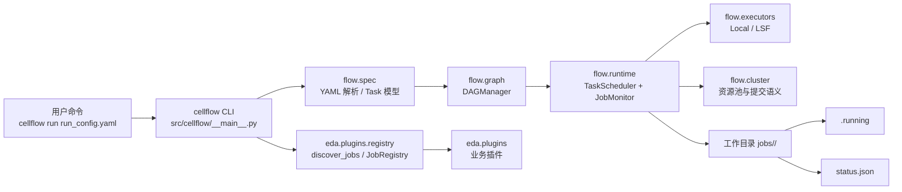

# EDA Scheduler

面向 **EDA（电子设计自动化）** 场景的 **分布式任务调度与自动化编排** 框架：在隔离的执行环境中组织工具链，支持 DAG 依赖、本地与集群双轨执行，并通过工作区内的标志文件与 `status.json` 实现无状态、可恢复的任务监控。

---

## 核心特性

| 能力 | 说明 |
|------|------|
| **软硬环境隔离** | 通过 `FLOW_ROOT`、`PYTHONPATH` 与 `bin/env.sh` 区分「只读软件树」与用户工程目录；工作区路径校验避免将产物写入安装区。 |
| **DAG 任务编排** | 基于 YAML 的 `FlowConfig` 与 `TaskConfig`，由 `DAGManager` 维护依赖与就绪关系，支持环检测。 |
| **本地 / 集群双轨** | `config` 中的执行模式可切换本地执行器（如 `LocalExecutor`）与集群提交（如 LSF 适配），上层调度逻辑与执行后端解耦。 |
| **无状态监控** | `JobMonitor` 轮询任务 `workspace_path` 下的 **`.running`** 与 **`status.json`**：不依赖长连接，适合 EDA 长作业与断点续跑场景。 |
| **插件化 EDA 作业** | `src/eda/plugins/` 下的插件继承 `eda.core.base.BaseEDAJob`，经 `eda.plugins.registry.JobRegistry` 自注册，便于按工具扩展而无需改调度内核。 |

---

## 架构图（图文）



**文字解读**：
- **flow** 负责“任务流”：构建、调度、监控、执行后端。
- **eda** 负责“EDA任务”：基类契约、插件注册、插件实现。
- **config** 负责运行配置模型，不绑定业务实现细节。

---

## 目录结构

```text
<仓库根>/
├── bin/                    # 环境入口：PATH / PYTHONPATH / FLOW_ROOT
├── src/
│   ├── flow/               # 任务流组件：DAG/YAML/调度/监控/执行后端
│   ├── eda/                # EDA任务组件：基类/注册/插件/可复用库
│   └── config/             # 软件基本配置：执行与运行时配置模型
├── tests/                  # pytest；临时与产物默认在 test_work/（见 pytest.ini）
├── share/                  # 用户可读示例与 Demo
│   ├── README_USER.md
│   └── demos/              # 示例 run_config.yaml、run_demo.sh
├── scripts/                # 开发用演示脚本（如本地并行 demo）
├── pyproject.toml
└── requirements.txt
```

| 路径 | 职责 |
|------|------|
| **`bin/`** | 提供 `env.sh`：导出 `FLOW_ROOT`（仓库根）、将 `bin` 与 `src` 加入 `PATH` / `PYTHONPATH`，实现与具体工程目录的隔离。 |
| **`src/flow/`** | **任务流组件**：工作流构建（DAG/YAML）、调度推进与监控、执行后端与集群资源提交。 |
| **`src/eda/`** | **EDA任务组件**：统一 `BaseEDAJob` 瘦契约与插件注册（`eda.plugins.registry`），插件实现位于 `eda/plugins/`。 |
| **`share/demos/`** | **用户使用区**：放示例输入、`run_config.yaml` 与 `run_demo.sh`，便于复制到自己的工程后改路径与任务参数。 |

---

## 快速上手

**前置**：Unix 风格 shell（Linux / macOS / **Git Bash** / WSL）。仓库根目录下已提供 `bin/env.sh`。

```bash
# 1. 进入仓库根（请将路径换为你的克隆路径）
cd /path/to/scheduler

# 2. 加载环境（FLOW_ROOT 指向仓库根，Python 可 import src 下包）
source bin/env.sh

# 3. 运行 share 中的示例（在 demo 目录内执行）
cd share/demos/01_basic_gds_to_k
chmod +x run_demo.sh 2>/dev/null || true
./run_demo.sh
```

`run_demo.sh` 会再次 `source` 相对路径下的 `bin/env.sh`，并调用 `cellflow run run_config.yaml`。若当前仓库中 **`cellflow` 仍为占位脚本**，终端会提示尚未接入真实 CLI；接入编排入口后，即可用同一套 `run_config.yaml` 驱动 DAG 与执行器。

**Python 开发者**（不依赖 `cellflow`）可直接在设置好 `PYTHONPATH=src` 的前提下使用任务流 API，例如 `YAMLParser`、`DAGManager`、`apply_flow_config_to_dag`（见 `tests/` 与 `src/flow/`）。

---

## 图文示例：一次最小运行

### 1) 示例 YAML（节选）

```yaml
execution:
  mode: local
  local_settings:
    max_parallel_jobs: 2

tasks:
  - id: task_a
    type: PLACEHOLDER
  - id: task_b
    type: PLACEHOLDER
    depends_on: [task_a]
```

### 2) 执行命令

```bash
source bin/env.sh
cellflow run share/demos/01_flow_dag/run_config.yaml
```

### 3) 任务工作目录产物（示意）

```text
jobs/
  task_a/
    .running      # 运行时创建
    status.json   # 结束后写入（Success/Failed + ppa）
  task_b/
    .running
    status.json
```

`status.json` 示例：

```json
{
  "status": "Success",
  "ppa": {}
}
```

---

## 测试与本地产物

- 运行测试：`python -m pytest tests`（配置见 `pytest.ini`）。
- pytest 临时目录与部分演示输出位于 **`test_work/`**（已在 `.gitignore` 中忽略）。

---

## 贡献与扩展

新增 EDA 工具或任务类型时，请阅读 **`CONTRIBUTING.md`**：在 **`src/eda/plugins/`** 以插件形式扩展，并遵守 **`status.json`** 与测试约定。
